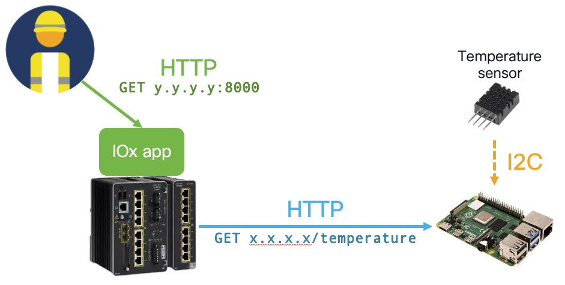

# Use IOx to monitor conditions on your factory floor

In this module, you will use an IOx application to monitor environmental conditions on your factory floor. Specifically, you will learn how to (1) build an IOx application, (2) package and deploy it on a Cisco IR1101, and (3) access it remotely. This could for instance be interesting when the machines on your factory floor need to operate within strict environmental circumstances (e.g., temperature) which you want to monitor from anywhere, at any time.



## Hardware requirements

1. A Cisco IR1101 supporting IOx. (This code was tested using IOS-XE version 17.12.02)

3. Connected to a downlink on the IR1101: a Raspberry PI 4.

4. On the Raspberry Pi: a I2C temperature sensor (e.g., [DHT20](https://www.adafruit.com/product/5183))

## Set-up your IR

1. Switch to the `ir` subfolder in your terminal.

```
$ cd 02-iox/ir
```

2. Fill out the `main.py` file with the IP address of your Raspberry PI.

```
rpi_address = "<address-of-your-raspberry-pi>"
```

3. Build the Docker container to run on the IR1101.

> [!NOTE]  
> For your app to work on an IR1101, execute this step on a computer with ARM64 architecture.

```
$ docker build -t ioxweb .
```

4. Package the container as an IOx application using [ioxclient](https://developer.cisco.com/docs/iox/#!iox-resource-downloads)

> [!NOTE]  
> For your app to work on an IR1101, execute this step on a computer with ARM64 architecture.

```
$ docker save -o rootfs.tar ioxweb
$ ./ioxclient package .
```

5. Now, you should see a `package.tar` file created in this subfolder. 

6. Upload, activate and start this package with id `ioxweb` in the IOx subsystem on the [IR1101 Local Manager](https://www.cisco.com/c/en/us/td/docs/security/cyber_vision/publications/IR1101/Release-4-2-0/b_Cisco_Cyber_Vision_Network_Sensor_Installation_Guide_for_Cisco_IR1101/m_Procedure_with_the_Local_Manager_IRxxxx.pdf).

7. Allow external access to this application via the IR1101 CLI.

```
interface vlan2 # The VLAN on the IR1101 connected to your remote machine
ip address 10.10.10.1 255.255.255.0
ip nat outside
ip virtual-reassembly
no shutdown

app-hosting appid ioxweb
app-vnic gateway0 virtualportgroup 0 guest-interface 0
guest-ipaddress 10.8.214.148 netmask 255.255.255.0
app-default-gateway 10.8.214.145 guest-interface 0

ip nat inside source static tcp 10.8.214.148 8000 interface Vlan2 8000 # To access the IOx app interface
ip nat inside source static tcp 10.8.214.148 80 interface Vlan2 5000 # To reach the API exposed by the Raspberry Pi
```

## Set-up your Raspberry Pi

1. Copy the `rpi` subfolder to your Raspberry Pi.

2. On the Raspberry Pi, build and start the Docker container exposing a temperature API.

```
$ docker build -t temperature .
$ docker run -d --network host --device /dev/i2c-1 temperature
```

## Instructions

1. In your favourite browser, navigate to `10.10.10.1:8000` and monitor the temperature measured by your Raspberry Pi.
